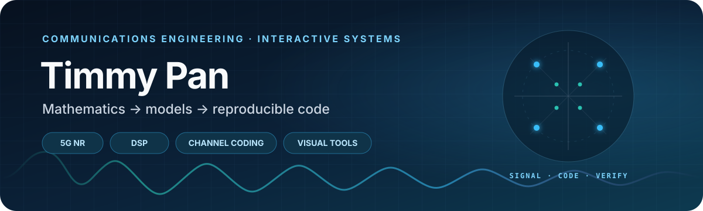

  

  
  
  

## About

I'm Timmy Pan, a communications engineer and frontend web developer based in Taiwan. My work connects mathematics, wireless systems, and software: from deriving a model to implementing it, reproducing the experiment, and making the result easier to understand.

> 我喜歡數學，也喜歡把抽象理論一路做到可重現、可驗證、看得見的結果。

  <code>derive</code> → <code>implement</code> → <code>simulate</code> → <code>verify</code> → <code>visualize</code>

## Focus

<table>
  <tr>
    <td width="50%" valign="top">
      <strong>Communication systems</strong> 
      5G NR physical layer, OFDM, MIMO, beamforming, and channel models.
    </td>
    <td width="50%" valign="top">
      <strong>Information and coding</strong> 
      Channel capacity, LDPC and convolutional codes, Viterbi and iterative decoding.
    </td>
  </tr>
  <tr>
    <td width="50%" valign="top">
      <strong>Signal processing</strong> 
      Complementary sequence design, correlation, and adaptive filtering.
    </td>
    <td width="50%" valign="top">
      <strong>Interactive systems</strong> 
      Rust and TypeScript applications, AI-assisted tools, and visual learning experiences.
    </td>
  </tr>
</table>

## Selected work

<table>
  <tr>
    <td width="50%" valign="top">
      <h3><a href="https://github.com/TimmyPan29/Project-LDPC-Code">LDPC Decoder &amp; AWGN Simulator</a></h3>
      
From-scratch <code>C11</code> implementation of SPA and MSA decoding with reproducible BER/BLER experiments.

      
<code>C</code> <code>LDPC</code> <code>AWGN</code> <code>Monte Carlo</code>

    </td>
    <td width="50%" valign="top">
      <h3><a href="https://github.com/TimmyPan29/Project-Information-theory">Channel Capacity via Blahut–Arimoto</a></h3>
      
A detailed derivation and NumPy implementation whose capacity result is independently verified with KKT conditions.

      
<code>Python</code> <code>LaTeX</code> <code>Information Theory</code>

    </td>
  </tr>
  <tr>
    <td width="50%" valign="top">
      <h3><a href="https://github.com/TimmyPan29/Project-Sequence-design">Binary Complementary Sequence Design</a></h3>
      
Cross-platform, tested tools for constructing and validating ZCPs, GCSs, and CZCSs.

      
<code>Python</code> <code>DSP</code> <code>Correlation</code>

    </td>
    <td width="50%" valign="top">
      <h3><a href="https://github.com/TimmyPan29/STT_Analyzer">STT Analyzer</a></h3>
      
A Rust and React application that turns audio, video, and YouTube sources into timestamped Traditional Chinese transcripts.

      
<code>Rust</code> <code>React</code> <code>TypeScript</code> <code>Gemini</code>

    </td>
  </tr>
</table>

## Toolbox

  
  
  
  
  
  
  

## Contribution trail

  <picture>
    <source
      media="(prefers-color-scheme: dark)"
      srcset="https://raw.githubusercontent.com/TimmyPan29/TimmyPan29/output/github-contribution-grid-snake-dark.svg"
    />
    <source
      media="(prefers-color-scheme: light)"
      srcset="https://raw.githubusercontent.com/TimmyPan29/TimmyPan29/output/github-contribution-grid-snake.svg"
    />
    
  </picture>

